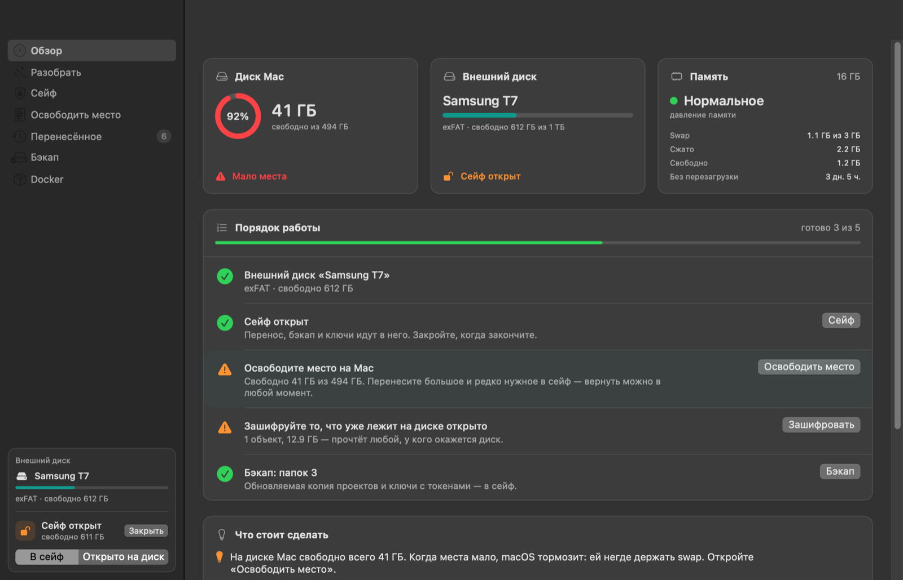
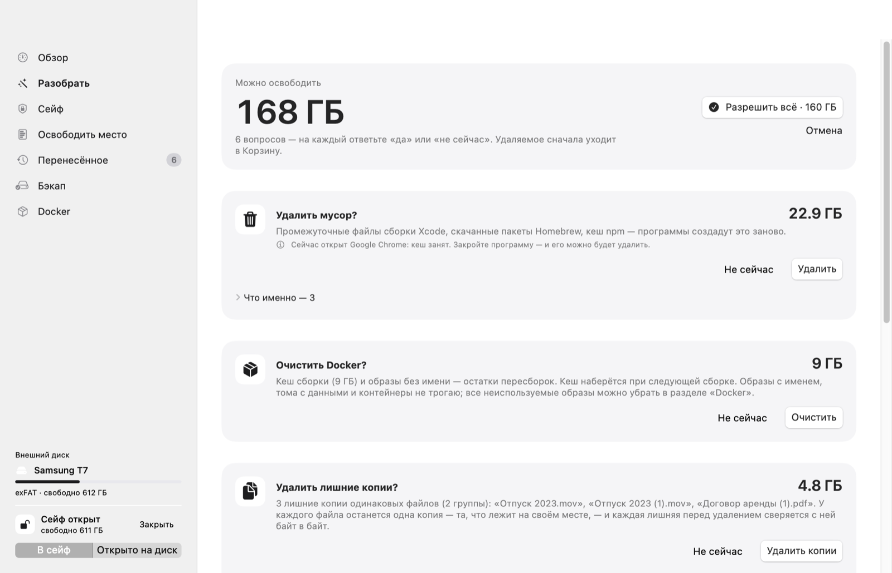
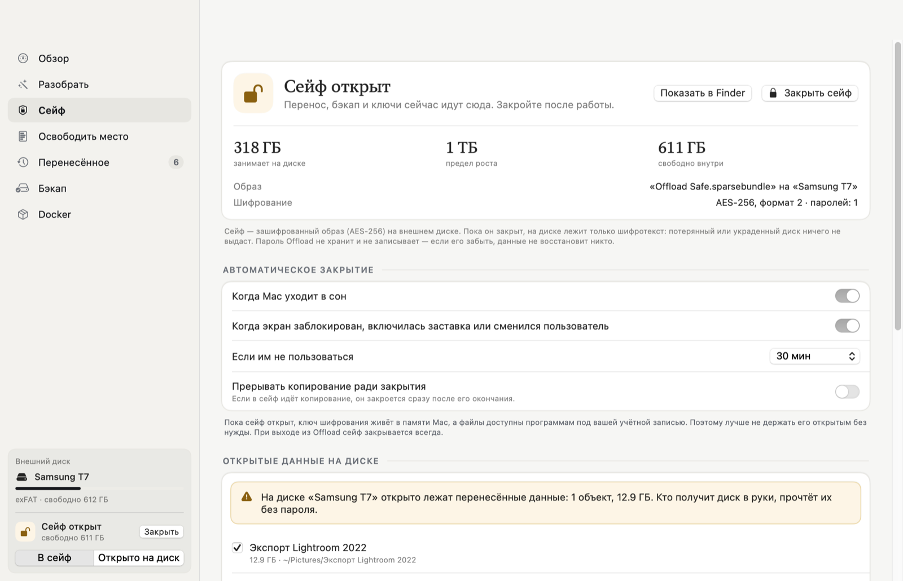
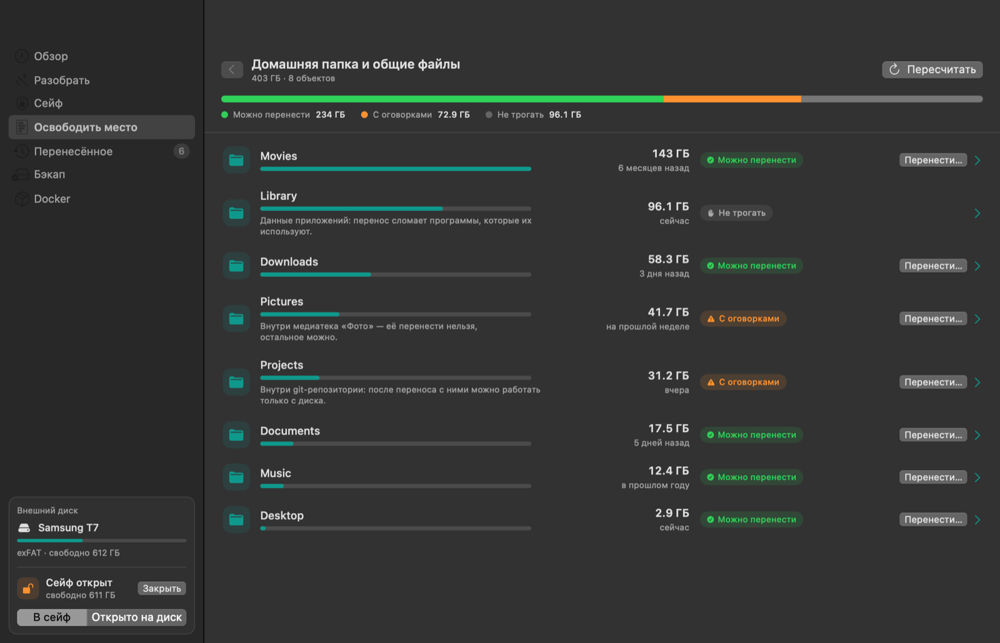
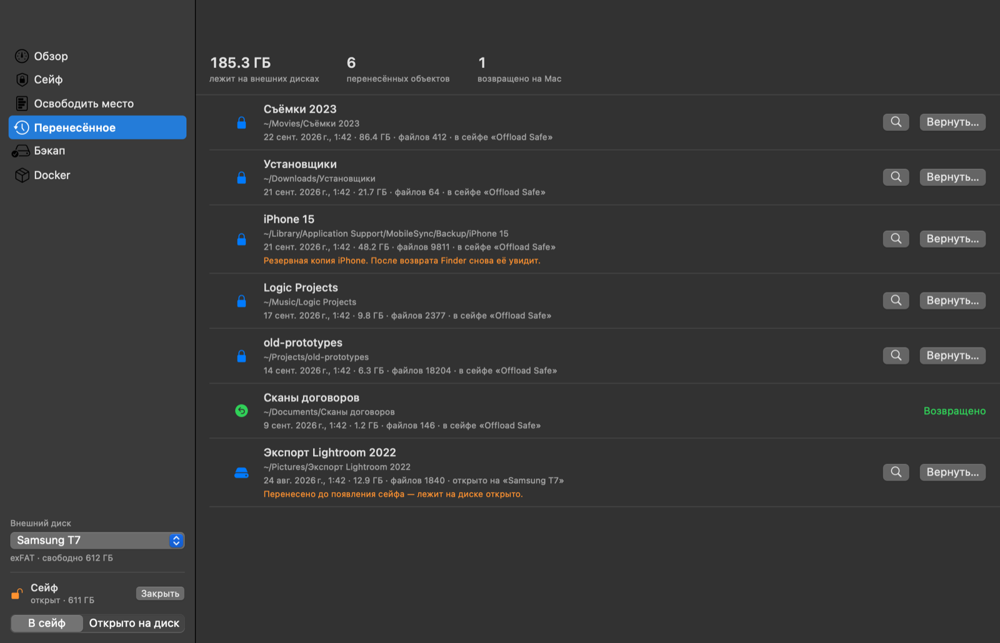
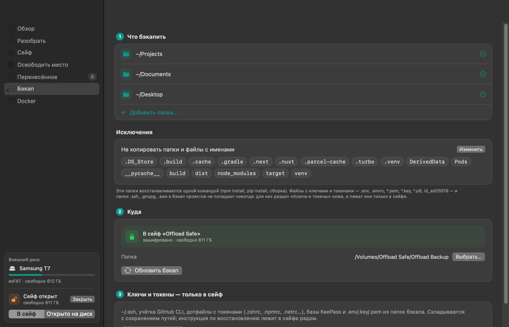

# Offload

Разгрузка диска Mac без риска потерять данные. Offload показывает, что занимает место, переносит выбранное в зашифрованный сейф на внешнем диске со сверкой каждого файла, делает обновляемый бэкап проектов и складывает туда же ключи и токены.

Главное правило: **оригинал удаляется только после того, как копия перечитана с диска и совпала с ним байт в байт.**



<table>
<tr>
<td></td>
<td></td>
</tr>
<tr>
<td align="center">Разобрать</td>
<td align="center">Сейф</td>
</tr>
<tr>
<td></td>
<td></td>
</tr>
<tr>
<td align="center">Освободить место</td>
<td align="center">Перенесённое</td>
</tr>
<tr>
<td colspan="2" align="center"></td>
</tr>
<tr>
<td colspan="2" align="center">Бэкап</td>
</tr>
</table>

<sub>Снимки сделаны в демонстрационном режиме: диск, папки и журнал вымышленные.</sub>

## Установка

Одной командой в Терминале:

```bash
curl -fsSL https://raw.githubusercontent.com/audit0/Offload/main/scripts/install.sh | zsh
```

Команда скачивает последний релиз с GitHub, сверяет SHA-256, подпись и идентификатор приложения, ставит Offload в «Программы» и запускает. `sudo` не нужен.

Хотите сначала прочитать установщик — это разумно для любой команды вида `curl | zsh`:

```bash
curl -fsSL https://raw.githubusercontent.com/audit0/Offload/main/scripts/install.sh -o install.sh
```

```bash
less install.sh && zsh install.sh
```

Конкретная версия: `OFFLOAD_VERSION=v0.1.0` перед `zsh`.

**Через DMG.** Скачайте `Offload.dmg` в [Releases](https://github.com/audit0/Offload/releases) и перетащите в «Программы». Приложение подписано ad-hoc, без нотаризации Apple, поэтому при первом запуске macOS его заблокирует. Разрешите запуск в «Системных настройках → Конфиденциальность и безопасность» и нажмите «Всё равно открыть».

Нужна macOS 14 или новее.

## Как пользоваться

Порядок работы виден на «Обзоре» — пять шагов с состоянием каждого:

1. **Подключите внешний диск.** Внизу боковой колонки — диск, его сейф и переключатель «В сейф / Открыто на диск».
2. **Заведите сейф** — зашифрованный образ на этом диске. Пока он закрыт, на диске только шифротекст.
3. **Освободите место на Mac**: перенесите большое и редко нужное в сейф. Вернуть можно в любой момент.
4. **Зашифруйте то, что уже лежит на диске открыто** — Offload покажет такие переносы и перенесёт их в сейф со сверкой.
5. **Настройте бэкап** проектов и ключей — тоже в сейф.

Когда шаги пройдены, дальше хватает одной кнопки: подключили диск — «Разобрать» → «Начать» — отметили личное, что хотите убрать, — «Выполнить».

## Что умеет

**Обзор.** Порядок работы, свободное место на Mac, давление памяти, swap, время без перезагрузки и сколько оперативной памяти занимает каждое приложение.

**Сейф.** Зашифрованный образ (AES-256, APFS внутри) на внешнем диске. Пароль задаёте вы и знаете только вы: Offload его не хранит и передаёт `hdiutil` только через stdin. Образ разрежённый — места он занимает столько, сколько в нём лежит, а предел выбираете вы: от 8 ГБ до всего диска. Мало оказалось — предел увеличивается, содержимое остаётся на месте. Что есть:
- проверка шифрования у самой macOS до открытия (`hdiutil isencrypted`: зашифрован и есть хотя бы один пароль) и после (`hdiutil info`: `image-encrypted`), без системных окон с запросом пароля;
- оценка стойкости пароля при создании и смене: не короче 12 символов и от 60 бит, с советами по-человечески;
- автоматическое закрытие: при сне, блокировке экрана, заставке, смене пользователя, простое и выходе из Offload; ⌘⇧L закрывает сейф из любого места;
- смена пароля без перешифровки данных, резервная копия заголовка и восстановление из неё;
- «Зашифровать перенесённое»: архивы, лежащие на диске открыто, переезжают в сейф со сверкой, открытые копии удаляются.

**Разобрать.** Как Smart Care в CleanMyMac: кнопка «Начать» — и найденное раскладывается по пяти плиткам, у каждой — размер, что отмечено и «Подробнее» со списком и объяснением каждой строки. Сразу отмечено только то, что ничем не рискует: **мусор** — места из списка Offload, которые программы пересоздают сами (кеши сборки Xcode, пакеты Homebrew, npm, pip, Yarn, Cargo, Gradle, CocoaPods, Go, кеши Chrome, Spotify, VS Code и сред JetBrains, прошивки iPhone), — и **проекты с git без бэкапа** (они только добавляются в список папок бэкапа). Кеш открытой программы сам не отмечается. Личное — **крупное и старое** (в сейф со сверкой), **лишние копии одинаковых файлов** и **старые установщики** — Offload находит и объясняет, а отмечаете вы: личные файлы, как и в CleanMyMac, сами не выбираются никогда. Одна кнопка «Выполнить» делает отмеченное; если для сейфа что-то отмечено, а он закрыт, пароль спрашивается тут же, и можно выполнить остальное без сейфа. Удаление — только в Корзину, и после разбора ушедшее туда можно одной кнопкой вернуть на прежние места или удалить насовсем, чтобы место освободилось сразу; сколько освободилось, Offload меряет по свободному месту на диске, а не складывает размеры. Правый щелчок по строке → «Не предлагать больше» — и объект (папка — со всем, что внутри) в разбор больше не попадает; список таких — на первой странице, вернуть можно в любой момент.

Одинаковые файлы сверяются по размеру, началу и концу файла и SHA-256 всего содержимого. Остаётся одна копия: та, что лежит на своём месте, а не в Загрузках, с именем без «(1)» и появившаяся раньше; лишние перед удалением ещё раз сверяются с ней байт в байт. Медиатеки «Музыки» и «TV», пакеты, git-проекты и файлы iCloud, которых нет на Mac, поиск не трогает. Клоны APFS, которые места не занимают, не предлагает. Зашифрованные образы `.dmg` и `.iso` (и их копии) удалить из разбора нельзя; старые установщики удаляете вы сами, каждый своей строкой. Решения запоминаются в базе на Mac (SQLite): тот же объект в следующий раз отмечен так же. Когда подключаете внешний диск, «Обзор» предлагает разобрать Mac.

**Привычки.** Offload учится на ваших решениях — только на этом Mac и без сети. Похожим считается то, что лежит в той же папке домашней, того же вида (папка, проект с git, видео, документ, копия одинакового файла…), примерно того же размера и давности. Когда похожее вы хотя бы трижды решили одинаково и так решены не меньше трёх четвертей похожих случаев, Offload отмечает так же, ставит пометку «как вы обычно» и объясняет: «Похожее вы обычно убираете в сейф (5 из 5): папки в «Фильмах» больше 10 ГБ». Если самые похожие решения расходятся, решают правила. Учитывается только ваш выбор: то, чего вы не трогали, не считается. Удаление привычка не отмечает никогда: в Корзину отмечаются только мусор по правилам и ваше решение по тому же файлу. Привычка может отметить похожее для сейфа или бэкапа, а лишнюю копию одинакового файла — оставить. Чему Offload научился, видно на первой странице «Разобрать»; там же кнопка «Забыть мои решения».

**Освободить место.** Размеры папок в домашней папке с переходом внутрь. У каждой строки пометка — «можно перенести», «с оговорками» или «не трогать» — и объяснение причины. Окно переноса всегда показывает, куда ляжет копия: в сейф или открыто на диск. У строк Docker и UTM вместо переноса — «Как освободить…»: Docker ведёт в свой раздел, а для UTM открывается список виртуальных машин с размерами (то же, что `du -sh …/*.utm`, и когда каждая менялась) и шаги — удалить или перенести машину через сам UTM, чтобы он её не потерял.

**Перенесённое.** Перенос: копирование → перечитывание копии и сверка SHA-256 → проверка, что оригинал не менялся → удаление оригинала. Рядом с архивом кладутся список контрольных сумм (совместим с `shasum -c`) и права доступа файлов. Журнал лежит на диске (для переносов в сейф — внутри сейфа), вернуть можно на любом Mac. Если архивом пользовались и он изменился, возврат не отказывает, а говорит, что именно изменилось. Переносы, сделанные раньше без Offload, добавляются кнопкой «+».

**Бэкап.** Обновляемая копия папок с проектами — в сейф или, если так решите, открыто на диск. `node_modules`, `.venv`, `dist` и другие восстанавливаемые папки пропускаются. Ключи и токены (`~/.ssh`, учётка GitHub CLI, дотфайлы с токенами, базы KeePass, `.env`, `*.pem`, `*.key`…) идут только в сейф и в бэкап проектов не попадают никогда. Заодно Offload предупреждает о SSH-ключах без парольной фразы.

**Docker.** Сколько внутри Docker занимают образы, кеш сборки, контейнеры и тома. «Освободить место…» сразу отмечает только кеш сборки и образы без имени (`<none>`, остатки пересборок). Все неиспользуемые образы — только если их отметить: собранный вами и никуда не отправленный образ не скачать заново. Остановленные контейнеры — тоже только по вашей отметке. Итог показывает, насколько после этого уменьшился `Docker.raw` на Mac. Тома очистка не трогает: в них данные. Список томов — с размером и контейнерами, которые их используют; неиспользуемые тома упаковываются в сейф (или на диск) со сверкой и возвращаются одной кнопкой.

### Как VeraCrypt и чем отличается

Как в VeraCrypt: AES-256, пароль не хранится и не пишется на диск, автозакрытие по сну, блокировке и простою, «закрыть всё» одним сочетанием, резервная копия заголовка, смена пароля без перешифровки данных.

Иначе: нет скрытых томов и правдоподобного отрицания, каскадов шифров и ключевых файлов. Формат образа — родной для macOS, его шифрование написала и проверяет Apple; своего шифрования Offload не изобретает. Если нужно отрицание самого существования данных — пользуйтесь VeraCrypt.

## Что Offload не даст сломать

Правила выросли из реальных случаев, когда «просто перенести папку» ломало систему:

- **Виртуальные машины и медиатеки** (`.utm`, `.photoslibrary` и др.) не переносятся — даже если лежат глубоко внутри выбранной папки. Приложение хранит на них ссылки и после переноса показывает «Недоступно», хотя данные целы.
- **Данные приложений в `~/Library`**, `~/.ssh`, `~/.config` и похожие папки не трогаются. Для известных крупных мест есть подсказка, как освободить их правильно: кеш Telegram чистится в самом Telegram, место Docker — в разделе «Docker», виртуальные машины UTM удаляются и переносятся в самом UTM.
- **Открытые файлы** — перенос запрещён, пока приложение их держит.
- **exFAT** не хранит права доступа и расширенные атрибуты. Права сохраняются рядом с архивом и возвращаются при восстановлении; если списка прав нет (например, у переноса, добавленного вручную), права выставляются обычные — папки 755, файлы 644, а скрипты и программы остаются исполняемыми. Служебные файлы `._*`, которые создаёт macOS, удаляются после сверки. Разрежённые файлы учитываются по полному размеру.
- **Метки Finder, комментарии и жёсткие ссылки** при переносе не сохраняются. Если они есть, Offload говорит об этом в окне переноса до того, как вы разрешите удалить оригинал.
- **Выход во время копирования** спрашивает подтверждение и доводит отмену до конца: незаконченная копия убирается, а не остаётся лежать скрытой папкой в полный размер.
- **Docker** по умолчанию пишет вывод контейнера в свой лог внутри `Docker.raw`, и поток архива на десятки гигабайт забивает диск. Offload отключает этот лог, останавливает сам контейнер, а не только клиент, и прерывает операцию, если `Docker.raw` начинает расти.

Подробности, модель угроз и известные ограничения — в [SECURITY.md](SECURITY.md).

## Полный доступ к диску

Без него Offload не видит «Документы», «Рабочий стол», Почту и данные многих приложений. Откройте «Системные настройки → Конфиденциальность и безопасность → Полный доступ к диску», включите Offload и перезапустите его. Кнопка для перехода в настройки есть в самом приложении.

## Сборка из исходников

Обычно хватает Xcode Command Line Tools (Swift 6), сам Xcode не нужен. Исключение — оговорка ниже.

Оговорка: начиная с SDK macOS 27 обёртки SwiftUI (`@State` и другие) стали макросами, а их плагин поставляется только с Xcode. Если у вас стоят одни Command Line Tools версии 27 и новее, `scripts/build-app.sh` сам соберёт приложение против SDK 26 из их состава, а если такого SDK нет — скажет, что нужен Xcode. Голый `swift build` в такой среде интерфейс не соберёт (проверки — соберёт, в них нет SwiftUI): собирайте через `scripts/build-app.sh`.

```bash
git clone https://github.com/audit0/Offload.git && cd Offload
```

Прогнать проверки:

```bash
swift run OffloadChecks
```

Собрать и установить в «Программы»:

```bash
scripts/install-local.sh
```

### Проверки

XCTest и swift-testing входят только в Xcode, поэтому проверки — отдельная программа `OffloadChecks` без зависимостей. Кроме правил и граничных случаев, она проверяет всё на настоящих данных:

- перенос и возврат на реальном exFAT-образе, созданном `hdiutil`;
- создание шифрованного контейнера и отказ при неверном пароле;
- архивацию и восстановление тома Docker, если Docker запущен (очистку Docker проверки не запускают — она удалила бы ваши образы);
- попытки внедрить команду через аргументы и подложить символическую ссылку на месте копии;
- подделанный журнал с путями наружу и подделанный архив с символической ссылкой за пределы папки.

Переменные `OFFLOAD_SKIP_INTEGRATION=1` и `OFFLOAD_SKIP_DOCKER=1` отключают соответствующие части.

### Снимки экранов

Для проверки интерфейса и скриншотов в README у приложения есть режим снимков: оно проходит по всем разделам, сохраняет каждый в PNG и завершается.

```bash
OFFLOAD_SNAPSHOT_DIR=/tmp/offload-shots dist/Offload.app/Contents/MacOS/Offload
```

`OFFLOAD_SNAPSHOT_SECTIONS=space,docker` ограничивает разделы, `OFFLOAD_SNAPSHOT_DEBUG=1` добавляет в stderr иерархию AppKit-вью с координатами — так была найдена ошибка, из-за которой раздел «Освободить место» вырастал больше окна. Снимки делаются средствами самого окна: разрешение «Запись экрана» не нужно.

`OFFLOAD_DEMO=1` включает демонстрационный режим: вымышленные диск, сейф, папки и журнал. В нём Offload ничего не читает с дисков, ничего не сохраняет в настройки и ничего не пишет в журнал, поэтому снимки не выдают ничьих настоящих папок. Снимки в начале README сделаны так:

```bash
OFFLOAD_DEMO=1 OFFLOAD_SNAPSHOT_DIR=/tmp/offload-shots OFFLOAD_SNAPSHOT_SECTIONS=overview,safe,space,history,backup dist/Offload.app/Contents/MacOS/Offload
```

### Релиз

Обновите версию в файле `VERSION`, закоммитьте и поставьте тег:

```bash
git tag v0.1.0 && git push origin v0.1.0
```

GitHub Actions прогонит проверки, соберёт universal-сборку (Apple Silicon + Intel), упакует `Offload.zip` и `Offload.dmg` с контрольными суммами и опубликует релиз. Установщик берёт файлы из последнего релиза.

## Лицензия

[MIT](LICENSE)

---

## English

Offload frees up space on a Mac without risking data loss. It shows what takes up disk space, moves selected items to an external drive, keeps an incremental backup of projects and stores keys and tokens in an encrypted container. The original is deleted only after the copy has been re-read from disk and matched byte for byte (SHA-256).

It refuses to move things that would break apps — virtual machines and media libraries (even nested deep inside a folder), app data in `~/Library`, `~/.ssh` — and handles exFAT pitfalls (permissions, AppleDouble `._*` files, sparse files) and a Docker trap where the archive stream fills `Docker.raw` via container logs.

Install:

```bash
curl -fsSL https://raw.githubusercontent.com/audit0/Offload/main/scripts/install.sh | zsh
```

Build from source with Xcode Command Line Tools: `swift run OffloadChecks`, then `scripts/install-local.sh`. With Command Line Tools 27+ and no Xcode, plain `swift build` cannot build the SwiftUI layer (the `@State` macro plugin ships with Xcode); `scripts/build-app.sh` falls back to the SDK 26 that ships with the same tools. The UI is in Russian. See [SECURITY.md](SECURITY.md) for the threat model. MIT licensed.
