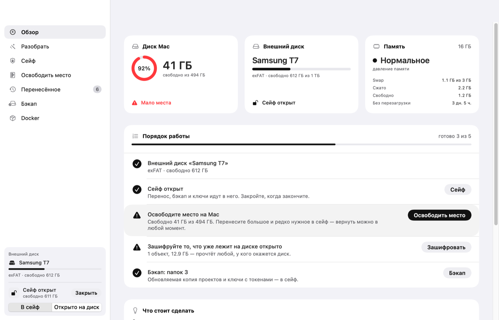
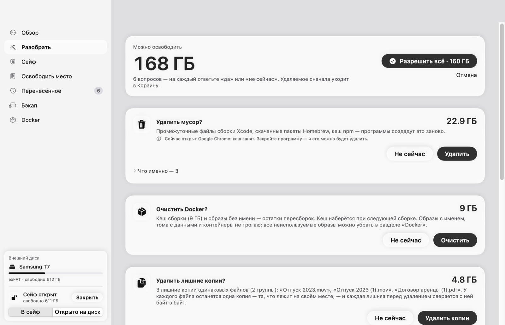
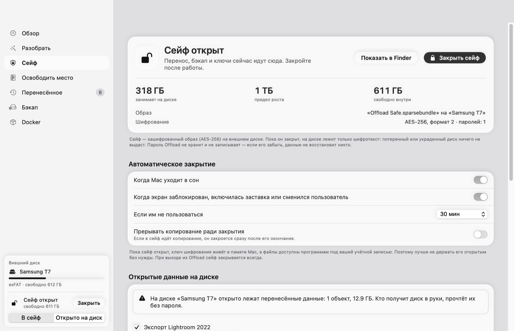
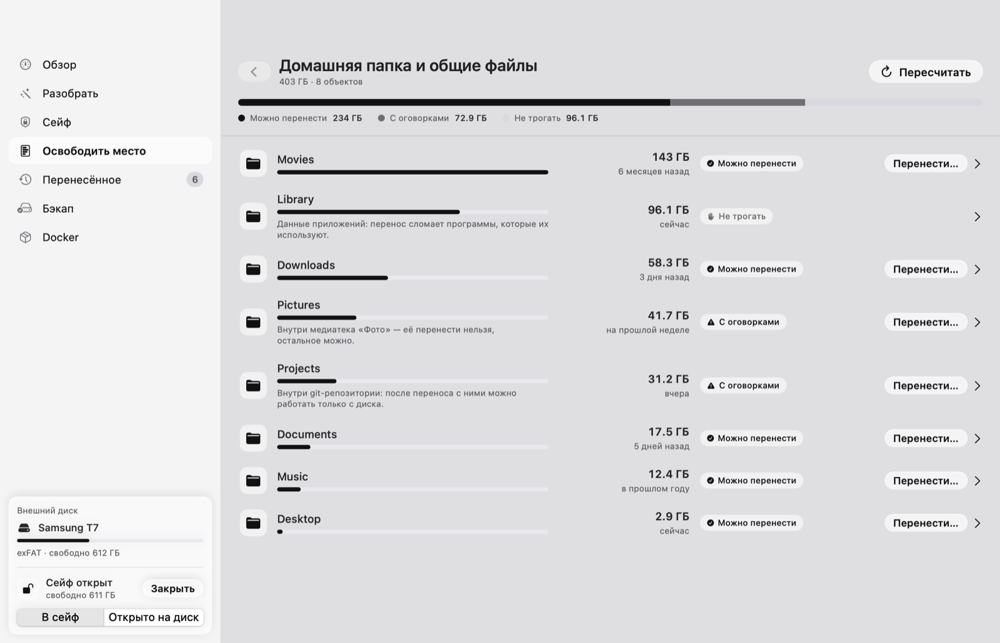
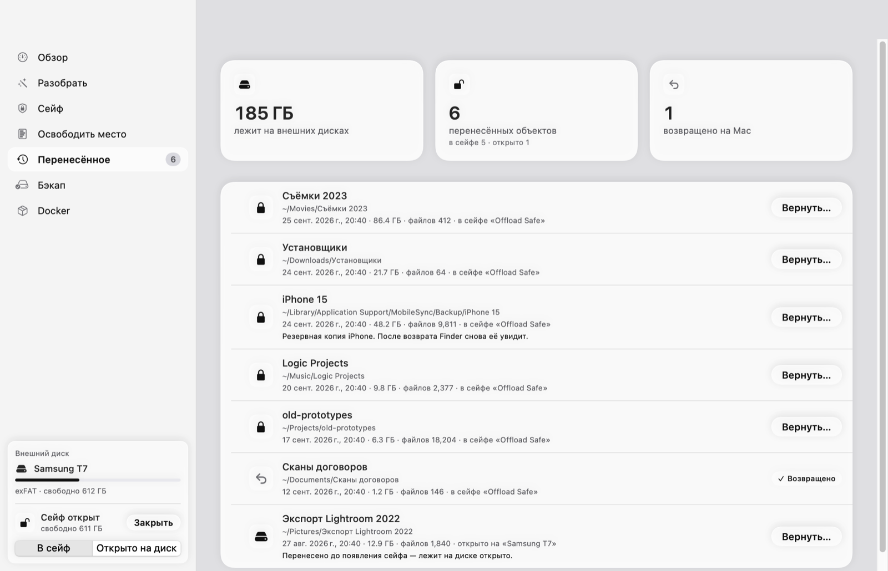
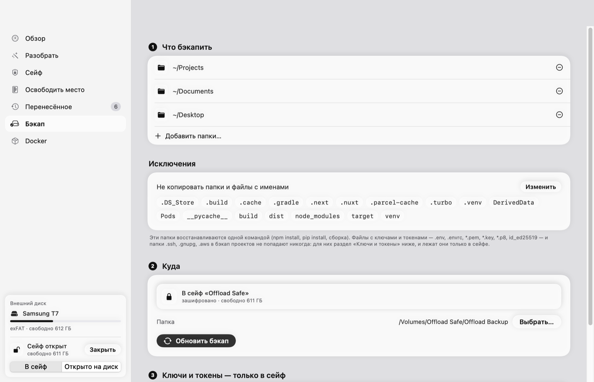

# OffLoadAI

Разгрузка диска Mac без риска потерять данные. Есть [версия для Windows](#windows). OffLoadAI показывает, что занимает место, переносит выбранное в зашифрованный сейф на внешнем диске со сверкой каждого файла, делает обновляемый бэкап проектов и складывает туда же ключи и токены.

Главное правило: **оригинал удаляется только после того, как копия перечитана с диска и совпала с ним байт в байт.**



<table>
<tr>
<td></td>
<td></td>
</tr>
<tr>
<td align="center">Разобрать</td>
<td align="center">Сейф</td>
</tr>
<tr>
<td></td>
<td></td>
</tr>
<tr>
<td align="center">Освободить место</td>
<td align="center">Перенесённое</td>
</tr>
<tr>
<td colspan="2" align="center"></td>
</tr>
<tr>
<td colspan="2" align="center">Бэкап</td>
</tr>
</table>

<sub>Снимки сделаны в демонстрационном режиме: диск, папки и журнал вымышленные.</sub>

## Установка

Одной командой в Терминале:

```bash
curl -fsSL https://raw.githubusercontent.com/audit0/Offload/main/scripts/install.sh | zsh
```

Команда скачивает последний релиз с GitHub, сверяет SHA-256, целостность подписи и идентификатор приложения, а если установлен `gh` — ещё и подтверждение сборки GitHub (что архив собран workflow этого репозитория). Затем ставит OffLoadAI в «Программы» и запускает. Открытый OffLoadAI установщик сначала закрывает; если идёт копирование, программа спросит, прервать ли его, а не закрылась — установка отменяется, ничего не тронув. Новая версия копируется рядом и встаёт на место прежней в последний момент, так что прерванная установка оставляет прежнюю версию. Прежнюю версию, которая называлась Offload, установщик закрывает и убирает; настройки, ключ Pro, журнал и сейф остаются как были. `sudo` не нужен.

Хотите сначала прочитать установщик — это разумно для любой команды вида `curl | zsh`:

```bash
curl -fsSL https://raw.githubusercontent.com/audit0/Offload/main/scripts/install.sh -o install.sh
```

```bash
less install.sh && zsh install.sh
```

Конкретная версия: `OFFLOAD_VERSION=v0.1.0` перед `zsh`.

**Через DMG.** Скачайте `OffLoadAI.dmg` в [Releases](https://github.com/audit0/Offload/releases) и перетащите в «Программы». Приложение подписано ad-hoc, без нотаризации Apple, поэтому при первом запуске macOS его заблокирует. Разрешите запуск в «Системных настройках → Конфиденциальность и безопасность» и нажмите «Всё равно открыть».

Нужна macOS 14 или новее.

## Как пользоваться

Порядок работы виден на «Обзоре» — пять шагов с состоянием каждого:

1. **Подключите внешний диск.** Внизу боковой колонки — диск, его сейф и переключатель «В сейф / Открыто на диск».
2. **Заведите сейф** — зашифрованный образ на этом диске. Пока он закрыт, на диске только шифротекст.
3. **Освободите место на Mac**: перенесите большое и редко нужное в сейф. Вернуть можно в любой момент.
4. **Зашифруйте то, что уже лежит на диске открыто** — OffLoadAI покажет такие переносы и перенесёт их в сейф со сверкой.
5. **Настройте бэкап** проектов и ключей — тоже в сейф.

Когда шаги пройдены, дальше хватает одной кнопки: подключили диск — «Разобрать» → «Начать» — ответили на вопросы «да» или «не сейчас».

## Что умеет

**Обзор.** Порядок работы, свободное место на Mac, давление памяти, swap, время без перезагрузки и сколько оперативной памяти занимает каждое приложение.

**Сейф.** Зашифрованный образ (AES-256, APFS внутри) на внешнем диске. Пароль задаёте вы и знаете только вы: OffLoadAI его не хранит и передаёт `hdiutil` только через stdin. Образ разрежённый — места он занимает столько, сколько в нём лежит, а предел выбираете вы: от 8 ГБ до всего диска. Мало оказалось — предел увеличивается, содержимое остаётся на месте. Что есть:
- проверка шифрования у самой macOS до открытия (`hdiutil isencrypted`: зашифрован и есть хотя бы один пароль) и после (`hdiutil info`: `image-encrypted`), без системных окон с запросом пароля;
- оценка стойкости пароля при создании и смене: не короче 16 символов и от 60 бит (повторы, клавиатурные ряды, годы и замены вроде «P@ssw0rd» оценка распознаёт), с советами по-человечески;
- автоматическое закрытие: при сне, блокировке экрана, заставке, смене пользователя, простое и выходе из OffLoadAI; ⌘⇧L закрывает сейф из любого места;
- смена пароля без перешифровки данных, резервная копия заголовка и восстановление из неё;
- «Зашифровать перенесённое»: архивы, лежащие на диске открыто, переезжают в сейф со сверкой, открытые копии удаляются.

**Разобрать.** Кнопка «Начать» — и OffLoadAI сам раскладывает найденное по вопросам, на каждый нужно ответить «да» или «не сейчас». Выбирать файлы и ходить по папкам не нужно. Вопросы такие: «Удалить мусор?» — места из списка OffLoadAI, которые программы пересоздают сами (кеши сборки Xcode, пакеты Homebrew, npm, pip, Yarn, Cargo, Gradle, CocoaPods, Go, кеши Chrome, Spotify, VS Code и сред JetBrains, прошивки iPhone); «Очистить Docker?» — кеш сборки и образы без имени, остатки пересборок (образы с именем, тома и контейнеры не трогаются; все неиспользуемые образы можно убрать в разделе «Docker»); «Удалить лишние копии?», «Удалить старые установщики?», «Убрать в сейф крупное и старое?» (со сверкой каждого файла), «Добавить проекты в бэкап?». Виртуальные машины UTM разбор не удаляет: удалять и переносить их нужно в самом UTM, иначе он их потеряет, — как это сделать, подсказывает «Освободить место» → «Как освободить…». У каждого вопроса — сколько освободится и одна строка о том, что в нём; полный список — по «Что именно». «Разрешить всё» отвечает «да» на всё, кроме установщиков: их удаляют только отдельным «да» на их вопрос, посмотрев список. Сделанное по «да» видно сразу у вопроса. Удаляемое уходит в Корзину: «Вернуть» у вопроса возвращает его на прежние места, а в конце OffLoadAI спросит, удалить ли это из Корзины насовсем, чтобы место освободилось сразу; сколько освободилось, он меряет по свободному месту на диске, а не складывает размеры. Кеш открытой программы в вопрос не входит. «Не сейчас» ничего не запоминает — в следующий раз вопрос будет снова; то, что вы вернули из Корзины, OffLoadAI больше не предлагает. Правый щелчок по строке в «Что именно» → «Не предлагать больше» — и объект (папка — со всем, что внутри) в разбор больше не попадает; список таких — на первой странице, вернуть можно в любой момент.

Одинаковые файлы сверяются по размеру, началу и концу файла и SHA-256 всего содержимого. Остаётся одна копия: та, что лежит на своём месте, а не в Загрузках, с именем без «(1)» и появившаяся раньше; лишние перед удалением ещё раз сверяются с ней байт в байт. Медиатеки «Музыки» и «TV», пакеты, git-проекты и файлы iCloud, которых нет на Mac, поиск не трогает. Клоны APFS, которые места не занимают, не предлагает. Зашифрованные образы `.dmg` и `.iso` (и их копии) удалить из разбора нельзя; старые установщики удаляются только по отдельному «да» на их вопрос. Решения запоминаются в базе на Mac (SQLite): тот же объект в следующий раз отмечен так же. Когда подключаете внешний диск, «Обзор» предлагает разобрать Mac.

**Привычки.** OffLoadAI учится на ваших решениях — только на этом Mac и без сети. Похожим считается то, что лежит в той же папке домашней, того же вида (папка, проект с git, видео, документ, копия одинакового файла…), примерно того же размера и давности. Когда похожее вы хотя бы трижды решили одинаково и так решены не меньше трёх четвертей похожих случаев, OffLoadAI поступает с похожим так же — кладёт его в тот же вопрос или не спрашивает о нём вовсе, — ставит в «Что именно» пометку «как вы обычно» и объясняет: «Похожее вы обычно убираете в сейф (5 из 5): папки в «Фильмах» больше 10 ГБ». Если самые похожие решения расходятся, решают правила. Учитывается только ваш выбор: «да» и то, что вы вернули из Корзины; «не сейчас» не учит. В вопросы об удалении привычка ничего не добавляет: удалить предлагается только мусор по правилам, лишние копии, старые установщики и давно не запускавшиеся машины. Привычка может добавить похожее в вопрос о сейфе или бэкапе, а лишнюю копию одинакового файла — оставить. Чему OffLoadAI научился, видно на первой странице «Разобрать»; там же кнопка «Забыть мои решения».

**Освободить место.** Размеры папок в домашней папке с переходом внутрь. У каждой строки пометка — «можно перенести», «с оговорками» или «не трогать» — и объяснение причины. Окно переноса всегда показывает, куда ляжет копия: в сейф или открыто на диск. У строк Docker и UTM вместо переноса — «Как освободить…»: Docker ведёт в свой раздел, а для UTM открывается список виртуальных машин с размерами (то же, что `du -sh …/*.utm`, и когда каждая менялась) и шаги — удалить или перенести машину через сам UTM, чтобы он её не потерял.

**Перенесённое.** Перенос: копирование → перечитывание копии и сверка SHA-256 → проверка, что оригинал не менялся → удаление оригинала. Рядом с архивом кладутся список контрольных сумм (совместим с `shasum -c`) и права доступа файлов. Журнал лежит на диске (для переносов в сейф — внутри сейфа), вернуть можно на любом Mac. Если архивом пользовались и он изменился, возврат не отказывает, а говорит, что именно изменилось. Переносы, сделанные раньше без OffLoadAI, добавляются кнопкой «+».

**Бэкап.** Обновляемая копия папок с проектами — в сейф или, если так решите, открыто на диск. `node_modules`, `.venv`, `dist` и другие восстанавливаемые папки пропускаются. Ключи и токены (`~/.ssh`, учётка GitHub CLI, дотфайлы с токенами, базы KeePass, `.env`, `*.pem`, `*.key`, состояние Terraform, ключи сервисных аккаунтов, `.git/config` с паролем в адресе…) идут только в сейф, а в открытый бэкап проектов не попадают. Узнаются они по именам, папкам и содержимому небольших файлов настроек; токен в файле с необычным именем и форматом можно не узнать, поэтому надёжнее всего вести бэкап в сейф. Заодно OffLoadAI предупреждает о SSH-ключах без парольной фразы.

**Из iCloud.** Вернуть файл или папку из бэкапа [restic](https://restic.net) в iCloud Drive — например, из копии внешнего диска, которую туда кладёт отдельная программа бэкапа. OffLoadAI сам находит хранилища в iCloud Drive (на два уровня вглубь; другое место можно выбрать), открывает их паролем — набранным (он уходит restic только через stdin) или из файла, который restic читает сам, — и показывает снимки: по папкам снимка можно ходить, а файл можно найти по части имени. Восстановленное ложится в новую папку «Из бэкапа …» и сверяется с бэкапом (`restic restore --verify`), существующее не перезаписывается. Если часть файлов не прочиталась (кусок бэкапа испорчен или так и не скачался), восстановленное остальное остаётся: такие файлы OffLoadAI убирает — restic оставил бы их полного размера, но с дырами, — и говорит, каких файлов нет и что остальное не сверено (после ошибок restic не сверяет). Хранилище OffLoadAI только читает (`--no-lock`: не пишет в него даже блокировку). Если часть бэкапа хранится только в облаке, OffLoadAI просит iCloud её скачать и говорит, что ждёт его. Пароль держится в памяти, пока хранилище открыто; сон и блокировка экрана его стирают. Нужен restic: `brew install restic`.

**Docker.** Сколько внутри Docker занимают образы, кеш сборки, контейнеры и тома. «Освободить место…» сразу отмечает только кеш сборки и образы без имени (`<none>`, остатки пересборок). Все неиспользуемые образы — только если их отметить: собранный вами и никуда не отправленный образ не скачать заново. Остановленные контейнеры — тоже только по вашей отметке. Итог показывает, насколько после этого уменьшился `Docker.raw` на Mac. Тома очистка не трогает: в них данные. Список томов — с размером и контейнерами, которые их используют; неиспользуемые тома упаковываются в сейф (или на диск) со сверкой и возвращаются одной кнопкой.

**Помощник.** Выберите папку — и помощник скажет, что в ней важно, что менее важно, а что мусор, и почему. Сам он ничего не удаляет и не переносит: у каждого совета кнопка, которая делает то же, что и без помощника, — перенос в сейф со сверкой или Корзина с возвратом («Вернуть» — там же). Удалить помощник может предложить только то, что разрешают правила «Разобрать»: места, которые программы создают заново, и установщики старше недели. Личное — только в сейф, что бы ни ответила модель. Думает он там, где вы выберете: Claude Code на этом Mac (под вашей учётной записью Claude), по вашему ключу Anthropic API (ключ — в связке ключей macOS), в локальной модели Ollama (сведения не покидают Mac) или на сервере OffLoadAI (для Pro, пока не запущен; вместе с вопросом туда уходит ваш ключ Pro — номер и имя из него). Модели уходят пути от домашней папки, размеры, даты, пометки правил и несколько имён внутри папок. Начало небольших текстовых файлов (до 20 строк) — только если вы это включите, и никогда — таблицы (`.csv`), файлы с ключами и те, где видны пароль, токен, номер карты или фраза восстановления. Согласие даётся отдельно на каждый вариант и отзывается одной кнопкой. Кроме помощника, в сеть выходят только сообщения о новых версиях — если вы их включили.

**Новые версии.** OffLoadAI один раз спросит, сообщать ли о них. Если да — раз в сутки он спрашивает у GitHub номер последней версии (в запросе нет ничего о компьютере и файлах, GitHub видит только адрес сети) и, когда вышла новая, пишет в боковой колонке «Вышла версия …» — с командой обновления и ссылкой на то, что нового. Сам он ничего не скачивает и не ставит. Включить или выключить — меню «OffLoadAI» → «Сообщать о новых версиях», проверить сразу — «Проверить обновления…»; на Windows — в «О программе OffLoadAI».

### Как VeraCrypt и чем отличается

Как в VeraCrypt: AES-256, пароль не хранится и не пишется на диск, автозакрытие по сну, блокировке и простою, «закрыть всё» одним сочетанием, резервная копия заголовка, смена пароля без перешифровки данных.

Иначе: нет скрытых томов и правдоподобного отрицания, каскадов шифров и ключевых файлов. Формат образа — родной для macOS, его шифрование написала и проверяет Apple; своего шифрования OffLoadAI не изобретает. Если нужно отрицание самого существования данных — пользуйтесь VeraCrypt.

## Что OffLoadAI не даст сломать

Правила выросли из реальных случаев, когда «просто перенести папку» ломало систему:

- **Виртуальные машины и медиатеки** (`.utm`, `.photoslibrary` и др.) не переносятся — даже если лежат глубоко внутри выбранной папки. Приложение хранит на них ссылки и после переноса показывает «Недоступно», хотя данные целы.
- **Данные приложений в `~/Library`**, `~/.ssh`, `~/.config` и похожие папки не трогаются. Для известных крупных мест есть подсказка, как освободить их правильно: кеш Telegram чистится в самом Telegram, место Docker — в разделе «Docker», виртуальные машины UTM удаляются и переносятся в самом UTM.
- **Открытые файлы** — перенос запрещён, пока приложение их держит.
- **exFAT** не хранит права доступа и расширенные атрибуты. Права сохраняются рядом с архивом и возвращаются при восстановлении; если списка прав нет (например, у переноса, добавленного вручную), права выставляются обычные — папки 755, файлы 644, а скрипты и программы остаются исполняемыми. Служебные файлы `._*`, которые создаёт macOS, удаляются после сверки. Разрежённые файлы учитываются по полному размеру.
- **Метки Finder, комментарии и жёсткие ссылки** при переносе не сохраняются. Если они есть, OffLoadAI говорит об этом в окне переноса до того, как вы разрешите удалить оригинал.
- **Выход во время копирования** спрашивает подтверждение и доводит отмену до конца: незаконченная копия убирается, а не остаётся лежать скрытой папкой в полный размер.
- **Docker** по умолчанию пишет вывод контейнера в свой лог внутри `Docker.raw`, и поток архива на десятки гигабайт забивает диск. OffLoadAI отключает этот лог, останавливает сам контейнер, а не только клиент, и прерывает операцию, если `Docker.raw` начинает расти.

Подробности, модель угроз и известные ограничения — в [SECURITY.md](SECURITY.md).

## OffLoadAI Pro

Всё, что нужно, чтобы освободить место и не потерять данные, бесплатно навсегда: сейф, перенос со сверкой, возврат перенесённого, разбор (мусор, Docker, установщики, крупное в сейф), ключи и токены в сейф, восстановление из iCloud. Вернуть своё OffLoadAI не мешает никогда — ни без ключа, ни после пробы.

OffLoadAI Pro добавляет инструменты для тех, у кого Mac — рабочий инструмент:

- **Лишние копии** — одинаковые файлы по SHA-256; одна копия остаётся всегда, лишние уходят в Корзину.
- **Привычки** — OffLoadAI учится на ваших ответах и сам кладёт похожее в нужный вопрос.
- **Бэкап проектов** — обновляемая копия папок с проектами в сейф.
- **Тома Docker в сейф** — упаковка неиспользуемых томов со сверкой каждого файла.

**1 490 ₽ или $19, один раз.** Ключ работает всегда; новые версии — год, дальше продление за полцены, а не продлили — остаётся последняя версия того года. Первые 14 дней Pro открыт целиком, без ключа и регистрации. Если вы пользовались OffLoadAI до появления Pro, всё открыто навсегда.

Ключ проверяется на самом Mac подписью, без сети: ради ключа OffLoadAI в интернет не ходит. В сеть выходят только помощник — по вашему согласию и когда вы его спрашиваете (см. «Помощник») — и сообщения о новых версиях, если вы их включили. Ввести ключ — меню «OffLoadAI» → «OffLoadAI Pro…».

### Как купить

В Telegram-боте [@OffLoadAIbot](https://t.me/OffLoadAIbot?start=pro) (кнопка «Купить…» в окне «OffLoadAI Pro» ведёт туда же): оплата Telegram Stars, криптовалютой (CryptoBot, xRocket, USDT TRC20/TON, TON) или по СБП. Ключ приходит сообщением сразу после оплаты; вставьте его в окне «OffLoadAI Pro». Возврат — 14 дней, напишите в том же боте. Новости и релизы — в канале [@OffLoadAI](https://t.me/OffLoadAI).

## Полный доступ к диску

Без него OffLoadAI не видит «Документы», «Рабочий стол», Почту и данные многих приложений. Откройте «Системные настройки → Конфиденциальность и безопасность → Полный доступ к диску», включите OffLoadAI и перезапустите его. Кнопка для перехода в настройки есть в самом приложении.

## Сборка из исходников

Обычно хватает Xcode Command Line Tools (Swift 6), сам Xcode не нужен. Исключение — оговорка ниже.

Оговорка: начиная с SDK macOS 27 обёртки SwiftUI (`@State` и другие) стали макросами, а их плагин поставляется только с Xcode. Если у вас стоят одни Command Line Tools версии 27 и новее, `scripts/build-app.sh` сам соберёт приложение против SDK 26 из их состава, а если такого SDK нет — скажет, что нужен Xcode. Голый `swift build` в такой среде интерфейс не соберёт (проверки — соберёт, в них нет SwiftUI): собирайте через `scripts/build-app.sh`.

```bash
git clone https://github.com/audit0/Offload.git && cd Offload
```

Прогнать проверки:

```bash
swift run OffloadChecks
```

Собрать и установить в «Программы»:

```bash
scripts/install-local.sh
```

### Проверки

XCTest и swift-testing входят только в Xcode, поэтому проверки — отдельная программа `OffloadChecks` без зависимостей. Кроме правил и граничных случаев, она проверяет всё на настоящих данных:

- перенос и возврат на реальном exFAT-образе, созданном `hdiutil`;
- создание шифрованного контейнера и отказ при неверном пароле;
- архивацию и восстановление тома Docker, если Docker запущен (очистку Docker проверки не запускают — она удалила бы ваши образы);
- попытки внедрить команду через аргументы и подложить символическую ссылку на месте копии;
- подделанный журнал с путями наружу и подделанный архив с символической ссылкой за пределы папки.

Переменные `OFFLOAD_SKIP_INTEGRATION=1` и `OFFLOAD_SKIP_DOCKER=1` отключают соответствующие части.

### Снимки экранов

Для проверки интерфейса и скриншотов в README у приложения есть режим снимков: оно проходит по всем разделам, сохраняет каждый в PNG и завершается. Работает только вместе с демонстрационным режимом (`OFFLOAD_DEMO=1`, см. ниже): иначе любая программа могла бы запустить OffLoadAI с полным доступом к диску и получить снимки ваших настоящих папок.

```bash
OFFLOAD_DEMO=1 OFFLOAD_SNAPSHOT_DIR=/tmp/offload-shots dist/OffLoadAI.app/Contents/MacOS/OffLoadAI
```

`OFFLOAD_SNAPSHOT_SECTIONS=space,docker` ограничивает разделы, `OFFLOAD_SNAPSHOT_DEBUG=1` добавляет в stderr иерархию AppKit-вью с координатами — так была найдена ошибка, из-за которой раздел «Освободить место» вырастал больше окна. Снимки делаются средствами самого окна: разрешение «Запись экрана» не нужно.

`OFFLOAD_DEMO=1` включает демонстрационный режим: вымышленные диск, сейф, папки и журнал. В нём OffLoadAI ничего не читает с дисков, ничего не сохраняет в настройки и ничего не пишет в журнал, поэтому снимки не выдают ничьих настоящих папок. Снимки в начале README сделаны так:

```bash
OFFLOAD_DEMO=1 OFFLOAD_SNAPSHOT_DIR=/tmp/offload-shots OFFLOAD_SNAPSHOT_SECTIONS=overview,safe,space,history,backup dist/OffLoadAI.app/Contents/MacOS/OffLoadAI
```

### Релиз

Обновите версию в файле `VERSION`, закоммитьте и поставьте тег:

```bash
git tag v0.1.0 && git push origin v0.1.0
```

GitHub Actions прогонит проверки, соберёт universal-сборку (Apple Silicon + Intel), упакует `OffLoadAI.zip` и `OffLoadAI.dmg` с контрольными суммами и опубликует релиз. Установщик берёт файлы из последнего релиза.

## Windows

Версия для Windows лежит в папке [`windows/`](windows/) и делает то же самое, с теми же разделами, текстами и правилами. Одной командой в PowerShell:

```powershell
irm https://raw.githubusercontent.com/audit0/Offload/main/windows/scripts/install.ps1 | iex
```

Установщик скачивает архив последнего релиза, сверяет SHA-256 и (если стоит `gh`) подтверждение сборки, ставит `OffLoadAI.exe` в `%LOCALAPPDATA%\Programs\OffLoadAI` и добавляет ярлык в меню «Пуск». Права администратора не нужны. Нужна Windows 10 или 11, x64 или ARM. Отдельно .NET ставить не надо: `OffLoadAI.exe` самодостаточный.

Чем отличается от версии для Mac:

- **Сейф** — образ VHDX, зашифрованный BitLocker (XTS-AES-256) с паролем. Для него нужна Windows Pro, Enterprise или Education: в Home нет BitLocker. Подключать образы Windows разрешает только администратору, поэтому при первой операции с сейфом она один раз спросит разрешение (UAC). Остальное OffLoadAI делает с обычными правами. Смена пароля, копия заголовка, автозакрытие при сне, блокировке, простое и выходе, Ctrl+Shift+L — как на Mac. «Вернуть место на диск» переписывает сейф заново, со сверкой: сжать VHDX с BitLocker на месте Windows не умеет.
- **Корзина** — Корзина Windows. **Открытые файлы** определяются через Restart Manager, и OffLoadAI называет программу, которая их держит. **Виртуальные машины** — WSL, VirtualBox и VMware: их OffLoadAI не переносит и подсказывает, как освободить место в самой программе. **Docker** — Docker Desktop (`docker_data.vhdx`). **Из iCloud** работает с папкой iCloud Drive из «iCloud для Windows» и restic из `winget install restic.restic`.
- **OffLoadAI Pro** — то же, что на Mac: лишние копии, привычки, бэкап проектов и тома Docker в сейф; две недели пробы. Ключ один на обе системы и проверяется без сети.
- Разбор знает кеши Windows-версий тех же программ (npm, pip, NuGet, Gradle, Cargo, Go, Chrome, Edge, VS Code, JetBrains, Spotify…) и не трогает `AppData`, реестр пользователя, OneDrive и медиатеки.
- Журнал переносов в том же формате, что на Mac: подключив диск, заполненный на Mac, Windows покажет, что на нём лежит, но вернуть такой перенос можно только на Mac.
- `OffLoadAI.exe` не подписан сертификатом: если скачать его браузером, SmartScreen при первом запуске предложит «Подробнее → Выполнить в любом случае». Установщик PowerShell этого не требует.

Сборка из исходников — .NET SDK 10:

```powershell
dotnet run --project windows\src\Offload.Checks
```

```powershell
powershell -ExecutionPolicy Bypass -File windows\scripts\install-local.ps1
```

Проверки (`Offload.Checks`) прогоняют перенос и возврат на настоящем томе exFAT, создание, открытие, смену пароля и восстановление заголовка сейфа — эти части требуют прав администратора и Windows Pro; `OFFLOAD_SKIP_VAULT=1`, `OFFLOAD_SKIP_INTEGRATION=1` и `OFFLOAD_SKIP_DOCKER=1` их отключают. Режим снимков тот же: `OFFLOAD_DEMO=1` и `OFFLOAD_SNAPSHOT_DIR`. Релиз собирается тем же тегом: GitHub Actions выкладывает рядом с `OffLoadAI.dmg` архивы `OffLoadAI-Windows-x64.zip` и `OffLoadAI-Windows-arm64.zip`.

## Лицензия

[MIT](LICENSE)

---

## English

OffLoadAI frees up space on a Mac without risking data loss. It shows what takes up disk space, moves selected items to an external drive, keeps an incremental backup of projects, stores keys and tokens in an encrypted container and restores files from restic backups in iCloud Drive. The original is deleted only after the copy has been re-read from disk and matched byte for byte (SHA-256).

Everything needed to free up space and keep data safe is free forever; OffLoadAI Pro (a one-time $19 with a year of updates, 14-day trial, free for users of earlier versions) adds duplicate removal, learned habits, project backup and Docker volume archiving. The license key is verified offline with an Ed25519 signature — checking it needs no network. Only two optional parts go online, each only with your consent: a daily check for a new version (one GitHub API request for the latest release number, nothing about your computer or files; you update yourself with the install command), and the AI assistant (consent given per backend and revocable) when you ask it: it sends file paths relative to your home folder, sizes, dates and rule marks — file contents only if you turn that on, and never spreadsheets, key files or text that looks like a password, token, card number or recovery phrase. It can only suggest deleting what the cleanup rules already allow (regenerable caches and old installers); anything personal goes to the vault.

It refuses to move things that would break apps — virtual machines and media libraries (even nested deep inside a folder), app data in `~/Library`, `~/.ssh` — and handles exFAT pitfalls (permissions, AppleDouble `._*` files, sparse files) and a Docker trap where the archive stream fills `Docker.raw` via container logs.

Install:

```bash
curl -fsSL https://raw.githubusercontent.com/audit0/Offload/main/scripts/install.sh | zsh
```

Build from source with Xcode Command Line Tools: `swift run OffloadChecks`, then `scripts/install-local.sh`. With Command Line Tools 27+ and no Xcode, plain `swift build` cannot build the SwiftUI layer (the `@State` macro plugin ships with Xcode); `scripts/build-app.sh` falls back to the SDK 26 that ships with the same tools. A Windows version (WPF, .NET 10, BitLocker-encrypted VHDX vault) lives in `windows/`; install it with `irm https://raw.githubusercontent.com/audit0/Offload/main/windows/scripts/install.ps1 | iex`. The UI is in Russian. See [SECURITY.md](SECURITY.md) for the threat model. MIT licensed.
